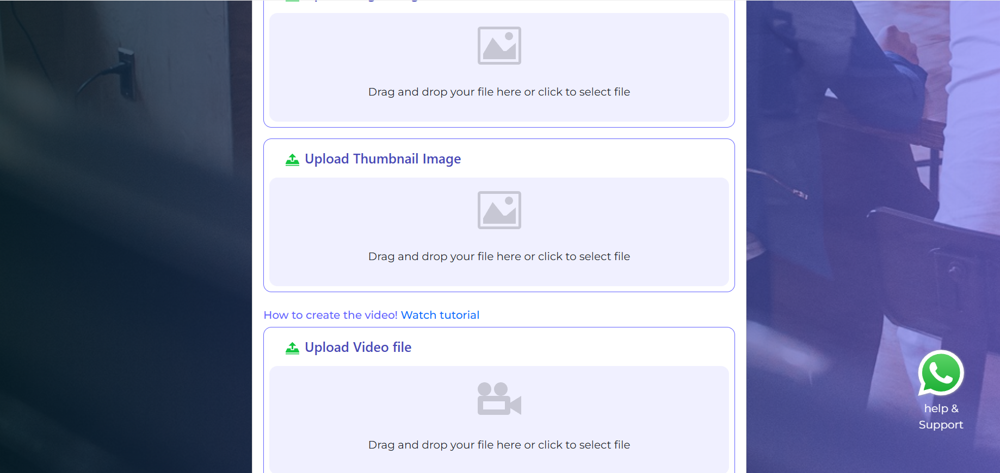

# Buymyequity.in

**Buymyequity.in** is a React-based web application developed to act as an introducer between investors and startup companies. The platform helps startups gain visibility and access to investment opportunities, acting purely as a facilitator and not as a stock exchange.

> **Disclaimer**:  
> Buymyequity.in is a conceptual portfolio project created for demonstration purposes only. It is not a Stock Exchange as defined under the Securities Contract Regulation Act, 1956. The platform design is intended to showcase development skills and merely simulates how connections between startups and investors could be facilitated.

> **Important**:
>This project is part of a personal portfolio. Do not copy, replicate, or use any part of the code or content without explicit permission from the developer. Unauthorized use may lead to legal action.
---

## 🛠 Developed By

**Abhishek Das**  
Web Developer 
Developed in : 2022

---

## 📦 Project Setup

### Prerequisites

Make sure you have the following installed:

- [Node.js](https://nodejs.org/) (v14 or later)
- [Yarn](https://classic.yarnpkg.com/lang/en/docs/install/)

 

## 📸 Screenshots

### Homepage

 